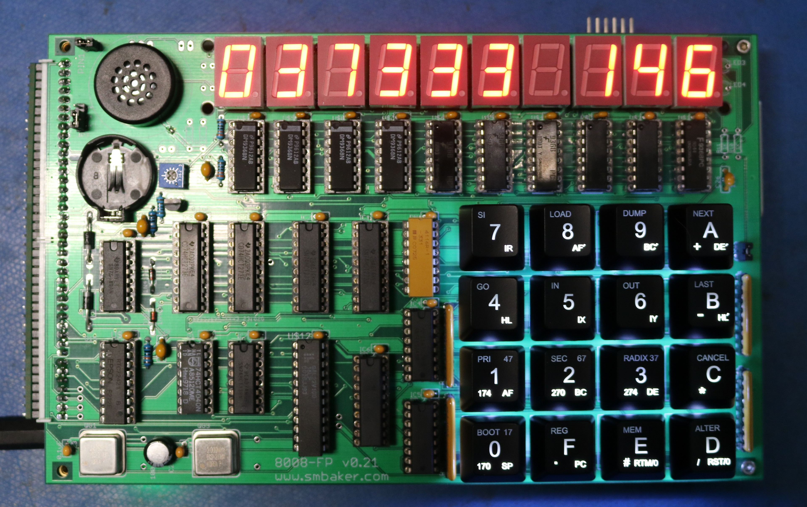
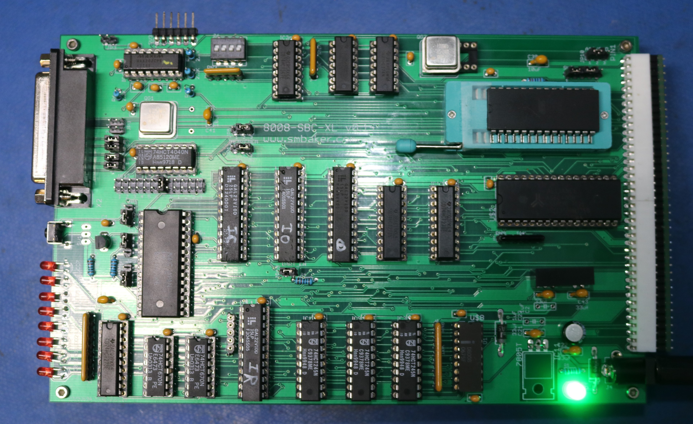

# Mini-08 Computer
### Scott Baker, https://www.smbaker.com/

## Description

The Mini-08 is a Single Board Computer (SBC) based on the Intel 8008 CPU, an 8-bit processor that was designed in approximately 1972. The Mini-08 has the following features

* 8008 CPU
* Up to 128 KB of RAM, mapped in 4K pages
* Up to 128 KB of ROM/EPROM/EEPROM, mapped in 4K pages
* On-board 8251 UART serial port
* 8 Onboard Diagnostic LEDs
* Support for interrupts
* A mostly-RC2014-compatible expansion bus connector

Also featured is an optional display board, which piggybacks on to the mini-08 and adds the following:

* Ten 7-segment hexadecimal display digits
* A 16-digit hexadecimal keypad
* Complex Sound Generator (3 music voices + 1 noise generator)
* Real-Time Clock

## Jumper Settings

### CPU Board

| Jumper | Position | Default | Description |
| ------ | -------- | --------| ----------- |
|   SJ1  |    1-2   |     X   | Two page registers (74HCT670) installed |
|        |    2-3   |         | Only one page register installed |
| JP2, JP12 |  JP12-1  |         | 115200 Baud |
|        |  JP12-2  |         | 57600 Baud |
|        |  JP12-3  |         | 38400 Baud |
|        |  JP12-4  |         | 19200 Baud |
|        |  JP12-5  |         | 9600 Baud |
|        |  JP12-6  |         | 4800 Baud |
|        |  JP12-7  |         | 2400 Baud |
|        |  JP12-8  |         | 1200 Baud |
|        |  JP2-1   |         | 600 Baud |
|        |  JP2-2   |         | 300 Baud |
|        |  JP2-3   |         | 150 Baud |
|        |  JP2-4   |         | 75 Baud |
|   JP4  |    1-2   |         | CTS follows DSR |
|        |    2-3   |     X   | CTS always on |
|   JP5  |    1-2   |     X   | MEMRD controlled by INTCON PLD |
|        |    2-3   |         | MEMRD directly controlled via bus PLD |
|   JP9  |    1-2   |     X   | RTS is RTS |
|        |    2-3   |         | RTS is DTR |
|   JP10 |    1-2   |     X   | RC2014-A8 is A12 |
|        |    2-3   |         | RC2014-A8 is GND |
|   JP11 |    1-2   |     X   | Power-on CPUINT controlled by INTCON PLD |
|        |    2-3   |         | INTCON PLD bypassed, CPUINT directly controlled by POR |
|   JP13 |          | Present | Enable 8251 UART |

### Display Board

| Jumper | Position | Default | Description |
| ------ | -------- | --------| ----------- |
|   SJ1  |          | Present | RTC-CS is GND |
|   JP1  |          | Present | Onboard speaker is enabled |
|   JP2  |          | Present | Enable keypad backlight |
|   JP3  |    1-2   |     X   | Front panel interrupt to INT pin |
|        |    2-3   |         | Front panel interrupt to FPINT pin (RC2014-A14) |

## Ports

The following describes the IO ports that I have allocated to various peripherals.

### Input

* 0 BB Serial / Dip Switches (internal)
* 1 Interrupt register (internal)
* 2 8251 UART - Data
* 3 8251 UART - Control
* 4 FP Keyboard
* 5 RTC
* 6 
* 7

### Output

* 8 BB Serial / LEDs (internal)
* 9 
* A FPEI (internal)
* B FPDI (internal)
* C mmap (internal)
* D mmap (internal)
* E mmap (internal)
* F mmap (internal)
* 10 Port multiplexer / RTC-ALE
* 11 Sound
* 12 8251 UART - Data
* 13 8251 UART - Conrol
* 14 
* 15 RTC
* 16 
* 17
* 18 FP Digits 0-1
* 19 FP Digits 2-3
* 1A FP Digits 4-5
* 1B FP Digits 6-7
* 1C FP Digits 8-9
* 1D FP Dots 0-7
* 1E FP Blanks 0-7
* 1F FP Dots 8-9, Blanks 8-9

Note to self: 18-1F were the IO Mapper on the H8 board. Some of my code may still output stuff to those ports.
